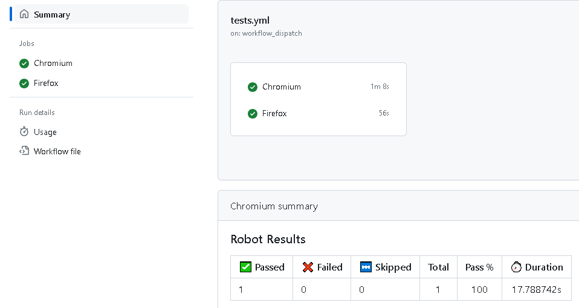
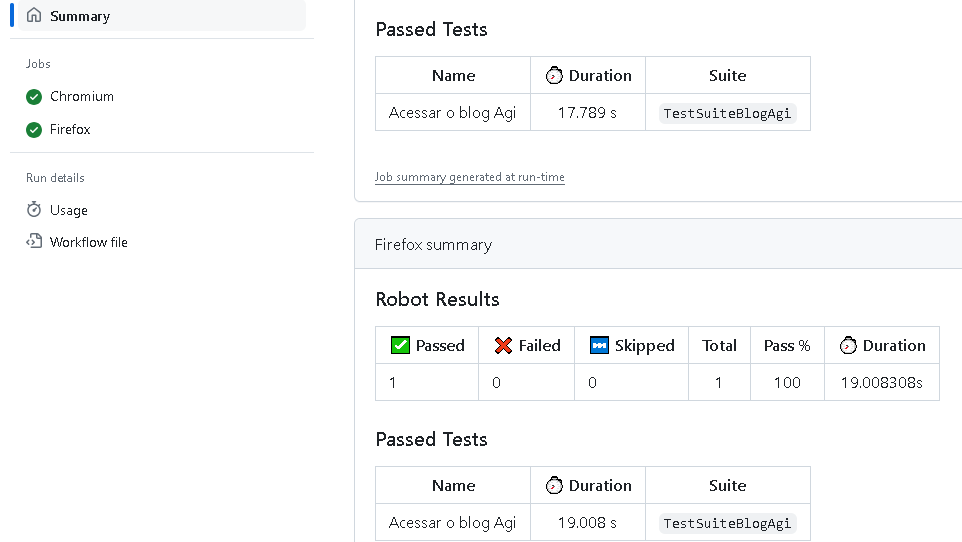
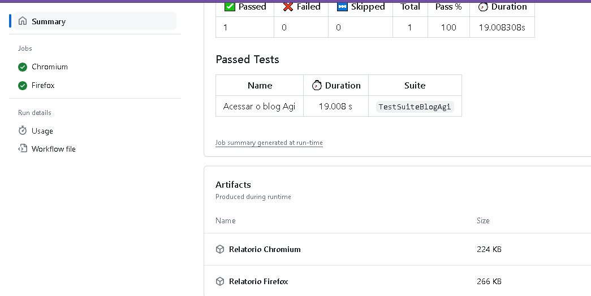
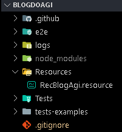

# robot    
Automacao com RobotFramework do Blog Agi e GitActions-CI

URL do Site automatizado:
https://blogdoagi.com.br/

### Project Report using Git Actions:  


No GitHub acesse o link abaixo, para rodar a PIPELINE[WorkFlow]:  
https://github.com/wagnerseixas/blogdoagi/actions/workflows/tests.yml

- run workflow

### WorkFlow de Exec

## Exibindo a tela inicial com os browser que foram executados
<div align="left">
    
<div>


## Exibindo a tela com execucao dos testes no browser especifico
<div align="left">
    
<div>


## Exibindo a tela com os artefactos[relatório por browsser] de exec para Download
<div align="left">
    
<div>


### Pre condicoes para rodar o projeto de testes em Robot:
```
1. Instalacao do Python 3.11, o mesmo deve estar setado na variavel de ambiente do SO.  
https://www.python.org/downloads/release/python-3110/

2. Instalacao do NodeJS:
https://nodejs.org/en/download

** Note: Para que o o RobotFramework rode corretamente com o Python, algumas biblioteca precisam ser instaladas

3. Install Libraries:

pip install robotframework
pip install robotframework-browser

4. Inicializar as library da biblioteca do Browser:
> rfbrowser init

```

### A versao do robot utilizada é 7.0.

### procedimento para axecutar o projeto local
```
- [] Crie uma pasta mkdir pastaprojeto - CMD
- []Cd pastaprojeto
- [] git clone https://github.com/wagnerseixas/blogdoagi.git
- [] cd blogagi   
- [] pip install robotframework
- [] pip install robotframework-browser
- [] rfbrowser init
- [] npm init playwright@latest
- [] npx playwright install --with-deps
- [] robot -d logs/ Tests/Tasks/TestSuiteBlogAgi.robot
- [] Acesse os relatórios : ..\blogdoagi\logs
```

============================


### Uma estrutura básica do projeto.

<div align="left">
    
<div>


### References: 

robotframework:  
https://docs.robotframework.org/docs  
https://robotframework.org/robotframework/latest/RobotFrameworkUserGuide.html  
browser library:  
https://robotframework-browser.org   
https://marketsquare.github.io/robotframework-browser/Browser.html  
https://github.com/MarketSquare/robotframework-browser#robotframework-browser  

Courses of Robot Framework (PT_BR):  
https://www.udemy.com/course/automacao-de-testes-com-robot-framework-basico/  
https://www.udemy.com/course/automacao-de-testes-com-robot-framework-avancado   
